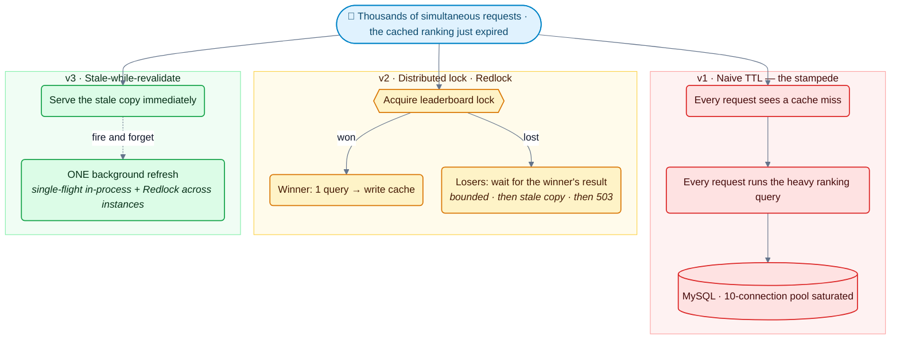
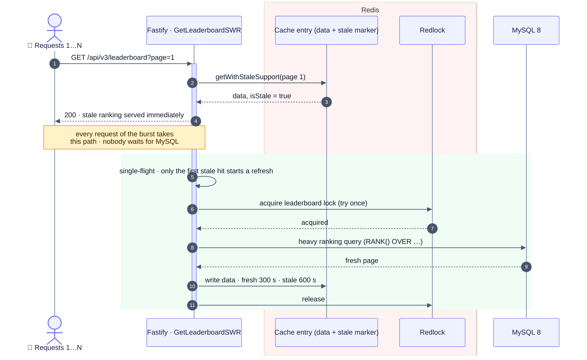
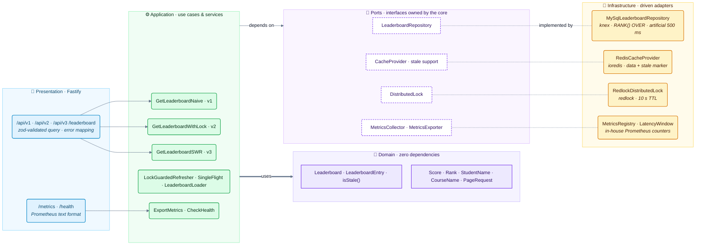

# 🛡️ leaderboard-cache-shield

> 10,000 students open the ranking at 19:00 and the cache expires. Naive caching sends
> **10,000 queries** to MySQL and fails **99.8%** of the requests — stale-while-revalidate sends
> **1** and fails **none**.

[](https://www.typescriptlang.org/)
[](https://nodejs.org/)
[](https://fastify.dev/)
[](https://redis.io/)
[](https://www.mysql.com/)
[](https://docs.docker.com/compose/)
[](#-tests)
[](#-tests)
[](./LICENSE)

---

## 🎯 The Problem — Cache Stampede

An e-learning platform shows a **student ranking** on its home screen: a heavy MySQL query
(JOINs, `SUM`, `RANK() OVER`, sorting over 525,000 enrollments) cached in Redis. When the cache
entry expires at peak time, every request misses at the same moment and runs the query itself —
the database pool saturates, requests time out, and the cache is never rebuilt in time.

The project implements three strategies side by side, as `v1`, `v2` and `v3` endpoints:



---

## 📊 Verified Results — `npm run loadtest:verify`

Measured on 2026-10-06 against the docker-compose stack (Fastify app + MySQL 8 + Redis 7), with
load generated **from inside the Compose network** by `autocannon` (`tools` container). Dataset:
105,000 students and 525,000 enrollments; one cold ranking query takes **2.3–3.6 s** (500 ms of it
is the configured artificial delay). Before each test the page expires the way it does in
production. MySQL queries come from the app's own `/metrics` counters.
Full report: [`load-tests/results.md`](load-tests/results.md) · raw data:
[`load-tests/results.json`](load-tests/results.json).

### The 19:00 spike — 10,000 simultaneous requests at expiry

| Strategy | MySQL queries | Failed requests | p50 | p99 | Stale copies served |
|---|---:|---:|---:|---:|---:|
| v1 · Naive TTL | **10,000** | **9,980** (99.8%) | 15.7 s | 17.7 s | 0 |
| v2 · Distributed lock | **1** | **6,395** (64%) ¹ | 7.4 s | 8.8 s | 0 |
| v3 · Stale-while-revalidate | **1** | **0** | 2.1 s ² | 3.4 s | 9,730 |

### What users feel — 50 connections of steady traffic for 15 s from the expiry on

| Strategy | Requests served | MySQL queries | Failed | p50 | p99 | **Worst request** | Throughput |
|---|---:|---:|---:|---:|---:|---:|---:|
| v1 · Naive TTL | 19,012 | 50 | 30 | 10 ms | 73 ms | **13.2 s** | 1,268 req/s |
| v2 · Distributed lock | 70,206 | 1 | 0 | 7 ms | 23 ms | **2.9 s** | 4,681 req/s |
| v3 · Stale-while-revalidate | 64,296 | 1 | 0 | 10 ms | 28 ms | **65 ms** | 4,287 req/s |

**Reading the numbers**

- **v1 is the stampede**: one query per request saturates the 10-connection pool; requests wait
  for a connection until the 10 s acquire timeout and fail. The cache is only rebuilt by luck.
- **v2 protects MySQL (1 query) but not the users**: everyone who arrives during the rebuild
  waits for it (worst request 2.9 s under steady traffic). ¹ Waiting is bounded to 5 s: when the
  rebuild is slower than that under a 10,000-request burst, waiters fall back to `503` — 6,395 of
  them in the run above, **0** in an earlier run where the rebuild finished within the budget.
  v2's outcome depends on rebuild time vs. wait budget.
- **v3 protects both**: the expired copy keeps being served while **one** background refresh
  (single-flight + Redlock) rebuilds it, so nobody waits for MySQL — worst request **65 ms**.
- ² Burst latencies include the cost of 10,000 TCP connections hitting one Node process at once:
  a warm cache with nothing to rebuild measures **p50 1.16 s for a 1,000-connection burst** on
  this machine. v3 adds ≈ nothing to that floor (453 ms p50 at 1,000 requests); v2 adds the
  rebuild (4.5 s p50 at 1,000 requests).

### How v3 works



---

## 🏗️ Architecture

**Clean Architecture + DDD + TypeScript (strict)** on Fastify 5.



```
src/
├── domain/           # Leaderboard, LeaderboardEntry (isStale), Score, Rank, StudentName, CourseName, PageRequest
├── application/      # v1/v2/v3 use cases, LockGuardedRefresher, SingleFlight, cache keys & policy, ports
├── infrastructure/   # MySQL repository (ranking query), Redis cache, Redlock lock, metrics registry, config
└── presentation/     # Fastify routes (/api/v1|v2|v3/leaderboard, /metrics, /health), CLI (migrate)
load-tests/           # verify-strategies.ts (autocannon) · run-stampede.ts · Artillery configs
```

### Key technical decisions

| Decision | Rationale | ADR |
|---|---|---|
| Stale-while-revalidate as the recommended strategy | Serves the expired copy instantly; one refresh in the background | [ADR-001](docs/adr/001-swr-over-simple-ttl.md) |
| Redlock for the refresh lock | Only one instance rebuilds a page; an *efficiency* lock (TTL-bounded), not a correctness lock — trade-offs documented | [ADR-002](docs/adr/002-distributed-lock-algorithm.md) |
| Three strategies exposed side by side | Makes the stampede and each fix measurable under the same load | [ADR-003](docs/adr/003-three-strategy-comparison.md) |
| In-house Prometheus registry | Zero-allocation counters + latency ring buffer behind a `MetricsCollector` port | [ADR-004](docs/adr/004-in-house-metrics.md) |
| Single-flight in-process + Redlock across instances | Coalesces refreshes locally before paying for a distributed lock | — |

Redis keys: `leaderboard:<v1|v2|v3>:page:<n>:data`, `…:stale` (freshness marker, 300 s) and
`…:lock`; data is kept for 600 s so v3 always has something to serve.

---

## 🔌 API

| Method | Path | Strategy |
|---|---|---|
| `GET` | `/api/v1/leaderboard?page=1` | Naive TTL — the stampede |
| `GET` | `/api/v2/leaderboard?page=1` | Distributed lock (Redlock), bounded wait |
| `GET` | `/api/v3/leaderboard?page=1` | Stale-while-revalidate |
| `GET` | `/metrics` | Prometheus text: cache hits/misses, stale served, lock waits, DB queries/errors, latency quantiles, event-loop lag |
| `GET` | `/health` | MySQL + Redis |

---

## 🚀 Quick Start

```bash
docker compose up -d --build                                       # MySQL, Redis, app (migrations on start)
docker compose --profile tools run --rm tools npm run seed         # 100k students, 500k enrollments (~90 s)
docker compose --profile tools run --rm tools npm run loadtest:verify  # the tables above (~4 min)

curl "localhost:3000/api/v3/leaderboard?page=1"
curl localhost:3000/metrics
```

Artillery configs (`load-tests/stampede-*.yml`, 10,000 arrivals in 1 s) run with
`npm run loadtest:naive|lock|swr`. Configuration: [`.env.example`](.env.example).

---

## 🧪 Tests

```bash
npm test               # 31 suites, 184 tests
npm run test:coverage  # 96.1% statements · 88.3% branches · 92.4% functions · 96.0% lines
```

Unit tests cover the entities and value objects, the three strategies including their
concurrency behaviour (many concurrent calls with fakes → one repository call for v2/v3), single
flight, the Redis/Redlock/MySQL adapters (with fakes), metrics and the HTTP layer. Integration
(Testcontainers) and e2e suites are not written yet; end-to-end behaviour is verified against the
real stack by `npm run loadtest:verify`.

## 🛠️ Scripts

| Script | Description |
|---|---|
| `npm run dev` / `npm run build` / `npm start` | Development server, production build, compiled server |
| `npm run migrate` / `npm run migrate:rollback` | Database migrations |
| `npm run seed` | 100k students + 500k enrollments (faker, batched inserts) |
| `npm run loadtest:verify` | Burst + steady-traffic verification of v1/v2/v3 → `load-tests/results.md` |
| `npm run loadtest` | Quick burst comparison (`STAMPEDE_REQUESTS`, default 500) |
| `npm run loadtest:naive` / `:lock` / `:swr` | Artillery, 10,000 arrivals in 1 s |
| `npm run docker:seed` / `docker:verify` | Same, from the Compose `tools` container |
| `npm run lint` / `typecheck` / `format:check` | Quality gates |

## 📚 Tech Stack

| Technology | Role |
|---|---|
| **TypeScript 5.9** (strict) · **Node.js 22.22+** | Language & runtime |
| **Fastify 5** | HTTP server |
| **Redis 7** + **ioredis** | Cache with stale support |
| **redlock** (5.0.0-beta) | Distributed lock |
| **MySQL 8** + **knex** / mysql2 | Ranking query (`RANK() OVER`), migrations |
| **zod** · **pino** | Validation · structured logging |
| **autocannon** · **Artillery** | Load generation |
| **Jest** | Unit tests |
| **Docker Compose** | Local stack + `tools` container for seeding/load |

## 📄 License

[MIT](./LICENSE)
